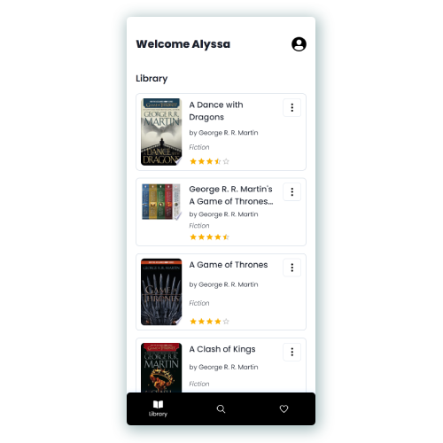

# 

### 📚 Find, search and store books from Google Books by [Ahnaf An Nafee](https://github.com/ahnafnafee)

   
  
   

### Features :sparkles:

:heart: **Minimal**: Minimalist UI for the most essential features

:electric_plug: **Real-time search**: Search books by name, author, genre etc...

---

## Built with

-   **FrontEnd**: _Next.js_
-   **BackEnd**: _Flask_
-   **Database**: _SQLite_

---

Bookworm is a mobile-targeted website where book lovers can search and store books they have read in their library. They will also be able to wish-list books they want to read. It’s an all-in-one book tracker.

## Users

The target demographic for this application will be book lovers in general but users from any category will be able to use it due to the ease of usage. Their goal with the system will be to keep track of all the books they have read so far, establishing the library component of the app, and the books they intend to read next, the Wishlist component of the app. Some of the constraints the user may face is viewing extra information about a particular book like an overview or overall ratings. The app is designed to be simply a tracker. Due to time constraints, book information cannot be supported for a better usability experience.

## System

As mentioned previously, the system is designed for book lovers, so the screens will cater to the essential information the end-user needs like Book Name, Author Name and Genre. Data will be queried from the Google Books API and NYT API. As the user, they will be able to search any book they want to within the app. They can either wish-list or add the book to their library. Users can basically keep a record of all the books they have read so far and what they plan to read next. The system features a basic authentication scheme where users can register and then add whatever books they want to add in their library. They can log back in anytime in the app if their session gets expired.
